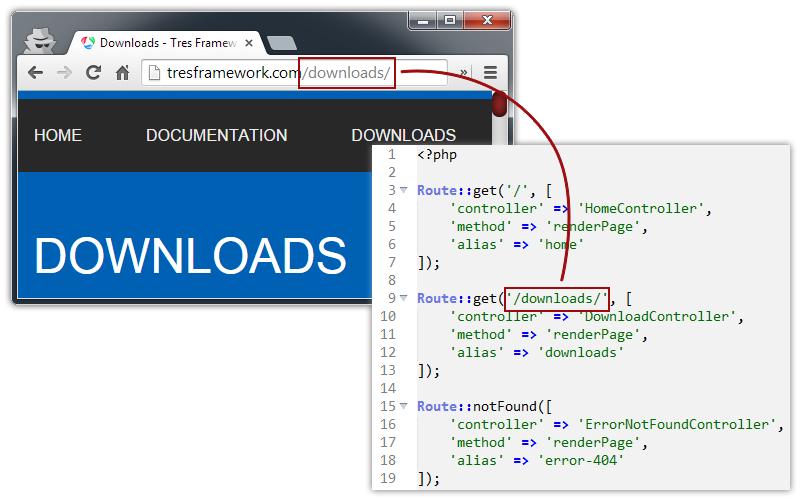

# Routing

## Introduction
A router generally forwards you to something. The router takes the URI,
matches it with a list and takes action based on that.

This technique adds a degree of separation between the files used to generate a webpage and the URL that is presented to the world. An addition to that is not only that it is search engine friendly, but also that it's prettier.

## Official supported packages
- [Tres router](Tres-router)
    - [Installation](Tres-router/install.md)
    - [Routing](Tres-router/routing.md)
